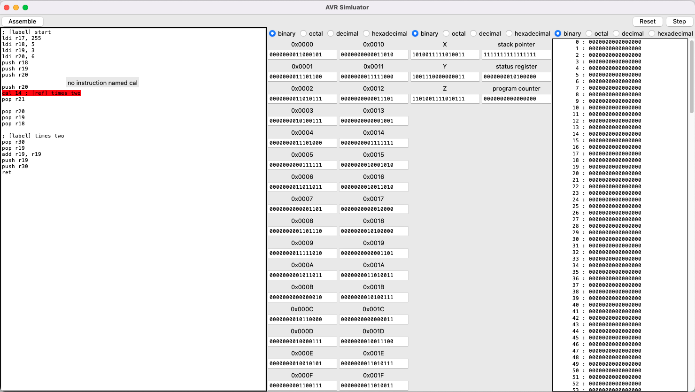

# AVR Zero
A simple AVR instruction set IDE and simulator for educational purposes.

> **Warning**
>
> This is in no way an accurate representation of the AVR instruction set and
> the AVR assembly. Programs that work in this simulator are not guaranteed to
> work on an actual AVR chip.



## Starting Guide

The project is available on PyPI, simply install it with `pip`.

```
python -m pip install avrzero
```

Then, you can run the graphics user interface with

```
python -m avrzero.gui
```

Or you can run the command line tools with

```
python -m avrzero
```

## Install from Source

First, you need to clone the GitHub repository.

At the project root, run

```
python -m build
```

The artifacts will be in the `dist` directory. Install with

```
python -m pip install --no-deps dist/avrsim-*-py3-none-any.whl
```
